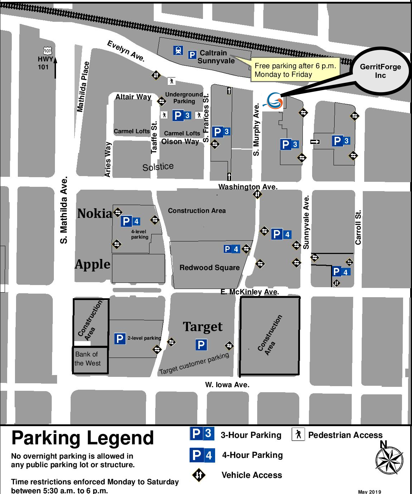

# Gerrit User Summit USA 2019 - Location

## USA - Hosted by GerritForge

The User Summit is hosted by GerritForge at [The Satellite - Sunnyvale](https://goo.gl/maps/no8vCBpqi61pv2jx5).

See below the full address of the location:

```
100 S Murphy Ave Suite 200
Sunnyvale, CA 94086
USA
```

## How to reach GerritForge from the San Jose Airport

__By Taxi__

[Uber](http://www.uber.com) and [Lyft](http://www.lyft.com) are the most popular ways of moving
around in the Silicon Valley. Use them if you are concerned about not finding parking space in Sunnyvale.

__By Car__

The travelling time from the San Jose Airport to downtown Sunnyvale is typically around 20 mins. However,
traffic conditions change rapidily in the Silicon Valley and the best route changes consequently.

Under normal conditions (very early morning, late evening and week-ends), the best route is:
- Get on CA-87 N from Airport Blvd
- Take US-101 N to N Mathilda Ave in Sunnyvale. Take the exit for Mathilda Avenue S from US-101 N
- Continue on N Mathilda Ave. Drive to S Murphy Ave
- Park in the nearby parking space next to Target

## Parking

Located on the corner of South Murphy Avenue and Evelyn Avenue, there are several options for parking in the area. See the map below.

Please note that on Saturday morning, a farmer’s market runs in Murphy Avenue, therefore this street is closed
for cars and the area can get busy with pedestrians.



## Hotels and Places to Stay

There are plenty of options for Hotels and Inns around Sunnyvale. However, at times, availability can
be limited because of the convenient location close to the [CalTrain station](http://www.caltrain.com/stations/sunnyvalestation.html).

We recommend one of the following two hotels nearby:

- [Maple Tree Inn](https://www.mapletreeinn.com/), 711 E El Camino Real, Sunnyvale, CA 94087, USA
- [Wild Palms Hotel](https://www.jdvhotels.com/hotels/california/sunnyvale/wild-palms-hotel), 910 EAST FREMONT AVENUE, SUNNYVALE, CA 94087

## Facility Resources

__Food and Drink__

Lunch will be provided at The Satellite location during the Summit.
Water and coffee will be available on-site also.

__Internet__

Wifi will be available to all attendees.

## Check-in Instructions

When you arrive at 100 S Murphy Avenue, please enter through the
[east entrance](https://goo.gl/maps/dcWVSNoytvBvTLpv8) between E Evelyn Ave and S Sunnyvale Ave
which faces the parking lot. Once entered into the building, go to the 2nd floor (for americans)
or 1st floor above ground (for europeans).

You will then find the signs of the Gerrit User Summit and GerritForge Inc. outside the door and the
welcome desk of the event.

You will receive at check-in:

- The Gerrit User Summit conference badge
- The Gerrit v3.0 celebration T-Shirt
- Stickers to remember about the event and on Gerrit Code Review